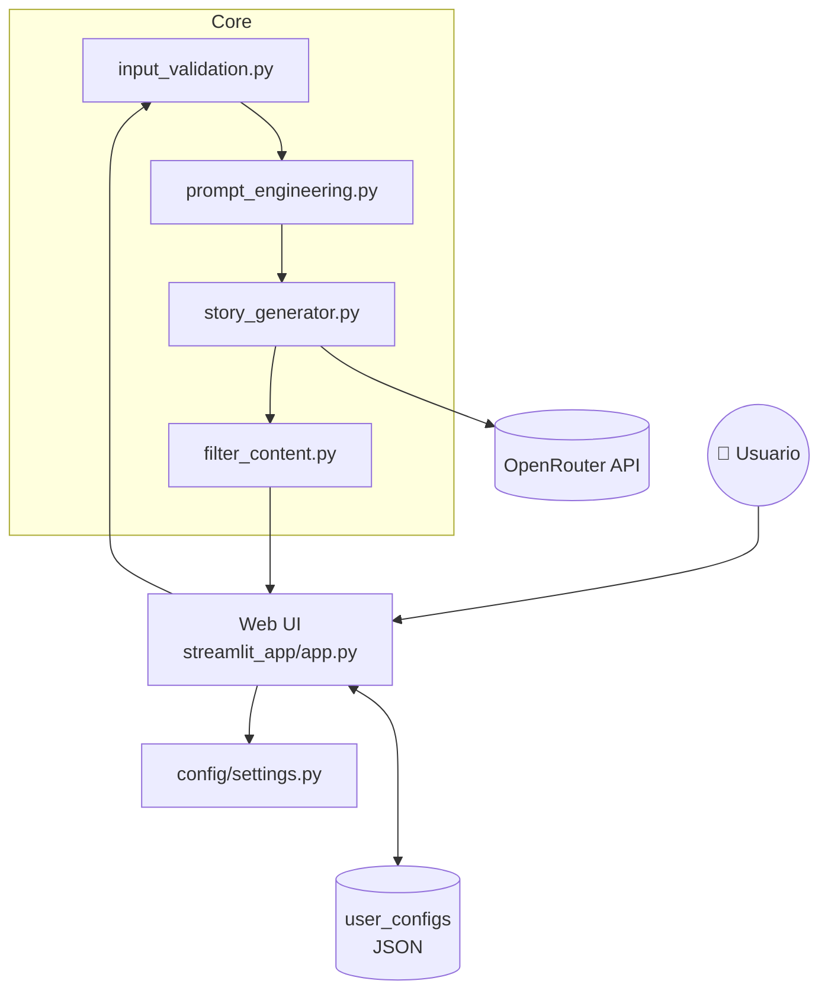

# 📖 Agente Creativo de Historias con LLMs

Genera relatos cortos interactivos (300 – 800 palabras) a partir de parámetros dados
por el usuario — personajes, escenario, género, tono, conflicto y más — controlando
estilo y longitud mediante _prompt engineering_.  
La aplicación se ejecuta sobre **Streamlit**, emplea modelos LLM vía **OpenRouter**
y persiste configuraciones favoritas localmente.

---

## ⚖️ Consideraciones Éticas

El proyecto adopta una política de **uso responsable y respeto a la creación literaria**:

1. **No imitación de autores famosos**  
   Optamos por no incluir un modo “escribe como _X_”. Aunque técnicamente viable,
   replicar estilos protegidos puede infringir derechos de autor, devaluar la obra
   original o inducir a confusión sobre su procedencia.

2. **Prevención de contenido dañino**  
   Integramos un módulo `filter_content.py` que detecta y bloquea lenguaje sexual
   explícito, insultos, discriminación y drogas antes y después de la generación.  
   Esto minimiza la posibilidad de que la IA produzca material ofensivo.

3. **Sesgos y representaciones justas**  
   Reconocemos que los LLMs reflejan los sesgos de sus datos de entrenamiento.
   Invitamos a los usuarios a **revisar críticamente** las historias y reportar
   estereotipos o parcialidades. Futuras versiones incluirán análisis de sesgo
   automatizado.

4. **Privacidad del usuario**  
   Los textos introducidos permanecen en el navegador; sólo los prompts mínimos
   se envían a la API. Las configuraciones favoritas se almacenan en un archivo
   local JSON dentro de `streamlit_app/user_configs/`.

---

## 📁 Estructura de Carpetas

```text
.
├── streamlit_app/
│   ├── app.py
│   └── user_configs/
│       └── configuraciones_favoritas.json
├── core/
│   ├── input_validation.py
│   ├── filter_content.py
│   ├── prompt_engineering.py
│   └── story_generator.py
├── config/
│   └── settings.py
├── tests/
│   └── test_prompt_engineering.py
├── examples/
│   └── historia_fantasia.txt
├── assets/
│   └── portada_historia_1.png
├── reporte/
│   └── reporte_tecnico.md
├── .streamlit/
│   └── secrets.toml
├── requirements.txt
└── README.md
```

---

## 🧱 Arquitectura del Sistema



---

## 🚀 Guía Rápida de Ejecución

### 1. Clonar y preparar ambiente

```bash
git clone https://github.com/vasquez-esteban/RNA_G4_PCR_App
cd RNA_G4_PCR_App
python3 -m venv .venv
source .venv/bin/activate  # Windows: .venv\Scripts\activate
pip install -r requirements.txt
```

### 2. Variables de entorno

Crear `.streamlit/secrets.toml` con:

```toml
OPENROUTER_API_KEY = "sk-xxxxxxxxxxxxxxxxxxxxxxxxxxxxxxxx"
```

### 3. Iniciar aplicación

```bash
streamlit run streamlit_app/app.py
```

---

## 📝 Scripts de utilidad

| Archivo                      | Propósito                                    |
| ---------------------------- | -------------------------------------------- |
| `core/input_validation.py`   | Valida y sanitiza los campos del usuario     |
| `core/filter_content.py`     | Filtra lenguaje sensible en entrada y salida |
| `core/prompt_engineering.py` | Construye prompts específicos por género     |
| `core/story_generator.py`    | Llama a la API de LLM y maneja errores       |
| `streamlit_app/app.py`       | Interfaz web, estado y persistencia          |

---

## ✅ Requisitos

- **Python 3.9+**
- Dependencias en `requirements.txt`

---

## 📄 Licencia

Distribuido bajo la [Licencia MIT](LICENSE).

---

## 🔗 Referencias

- Reporte Técnico: [Rpubs](https://rpubs.com/evasp/rna-g4-trabajo4)
- Video: [Ver aquí con correo UNAL](https://drive.google.com/file/d/1O8eBV7E-Si8bQlZb3boHebBrG73caPP7/view?usp=sharing)
- Lista de malas palabras: <https://github.com/LDNOOBW/List-of-Dirty-Naughty-Obscene-and-Otherwise-Bad-Words>
