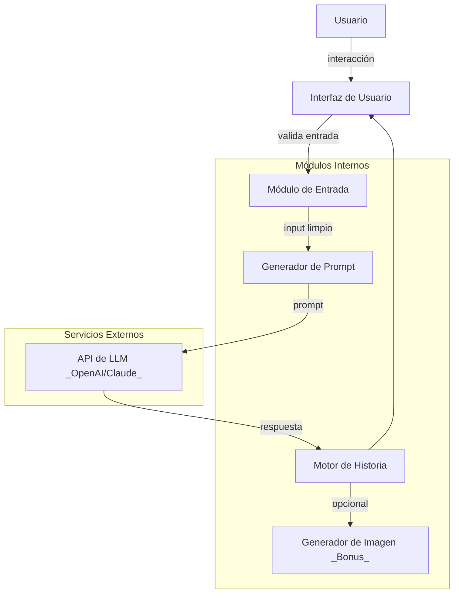

# Proyecto: Agente Creativo de Historias con LLMs

## Plan de Trabajo

### ✅ 1: Diseño y Base Técnica

- ✅ Implementar el Módulo de Procesamiento de Entradas.
- ✅ Estrategia de prompting inicial para un género.

---

### ✅ 2: Generación y UI

- 🟡 Motor de generación de historias (conexión API).
- ✅ Pruebas de generación.
- ✅ Desarrollar la Interfaz de Usuario.

---

### ✅ 3: Mejora, Pruebas y Extras

- ✅ Mejoras en prompts (estructura, personajes).
- ✅ Manejo de estado y errores.
- 🟡 Generación de imágenes (Si hay tiempo).

---

### 🟡 4: Documentación y Entregables

- 🟡 Documentar código y decisiones.
- 🟡 Generar historias de muestra.
- 🟡 Video demostración.
- 🟡 Redactar reporte técnico.
- 🟡 Revisión final, entrega.

---

## 📁 Estructura de Carpetas

```
streamlit_app/
├── app.py

core/
├── prompt_engineering.py
├── story_generator.py
├── input_validation.py

config/
├── settings.py

examples/
├── historia_fantasia.txt

assets/
├── portada_historia_1.png

reporte/
├── reporte_tecnico.md

tests/
├── test_prompt_engineering.py

.streamlit/
├── secrets.toml

requirements.txt
README.md
```

---

## 🧱 Arquitectura del Sistema



## Guía Rápida de Ejecución

### 1. Clonar el repositorio

```bash
git clone https://github.com/vasquez-esteban/RNA_G4_PCR_App
cd RNA_G4_PCR_App
```

### 2. Configurar entorno Python (Linux/macOS)

```bash
python3 -m venv .venv
source .venv/bin/activate
source setup.sh
```

#### En Windows:

```bash
python3 -m venv .venv
.venv\Scripts\activate
setup.bat
```

---

## Ejecutar la aplicación web

```bash
streamlit run streamlit_app/app.py
```

---

## Despliegue Con Streamlit

### Variables de entorno necesarias

Agregar las siguientes variables de entorno en un archivo `.streamlit/secrets.toml`:

`OPENAI_API_KEY = "sk-XXXXXXXXXXXXXXXXXXXXXXXXXXXX"`

---

## Requisitos

- Python 3.9+

Consultar `requirements.txt` para más detalles.

## Licencia

Distribuido bajo la [Licencia MIT](LICENSE).

## Referencias

- Reporte Técnico [Link](https://rpubs.com)
